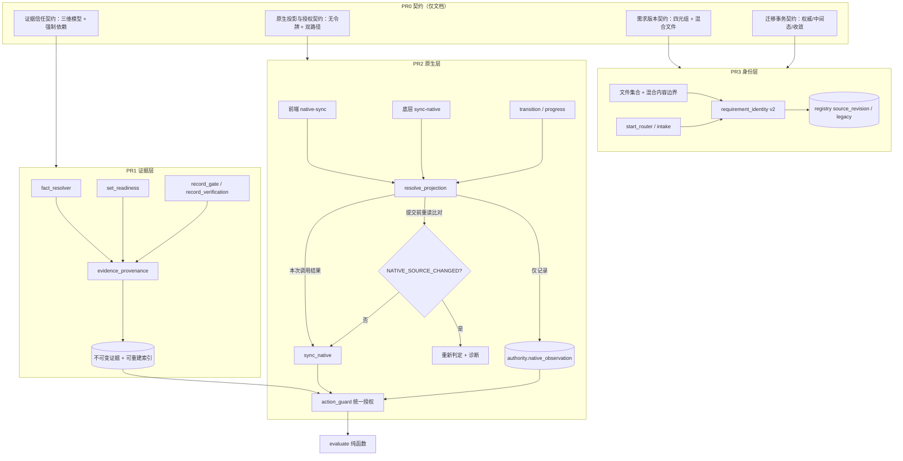

# 阶段 A（T1–T3）实施计划 v3

适用仓库：https://cnb.cool/wymix.top/coding-agent-orchestrator

本计划为 plan-2 的修订版，已吸收第二轮评审（plan-2-review.md）的 5 个 P1 与 4 项附加要求，保留第一轮评审已确认的修正。范围锁定阶段 A（T1–T3），不涉及自动恢复（T4/T5）与基准测量（T6/T7）。

本文件是待实施计划，不代表所述能力已存在。文中行号、skill 能力、宿主环境等"待核验"项必须在执行前逐一确认。

## 产品概述

在保留现有 SDD 原生所有权、统一 Action Guard、纯函数授权判断、内容快照、事务与乐观锁、不可静默删除的验证义务、按需上下文加载、TRIVIAL/FAST/STANDARD/DEEP 分层的前提下，把"规则完整、能记录证据"的工作流升级为"证据可核验、原生状态可从真实内容投影、需求身份可迁移"。

## 核心功能

- **PR0 四份短契约（先于代码实现）**：证据信任契约、原生投影与授权契约、需求版本契约、迁移事务契约。契约在现有项目指令与不变量约束下作为实现与评审依据（不覆盖已有更严格规则），固定字段、状态、失败码与可勾选验收条目。

- **T1 可核验证据记录（来源/校验/结论三维分离）**：证据由 `kind`（agent_claim / mechanical_observation / human_approval / native_result）、`validation_status`（unverified / verified / invalid）、`outcome`（passed / failed / approved 等，按类型定义）三个独立维度描述；可信来源的真实失败报告记为 `verified + failed` 而非 invalid，仅工作项、格式、来源或绑定不符才为 invalid。`strength=authoritative`、`actor`、`source_type`、`producer`、`verifier`、`evidence_ref` 均为记录字段，单独或组合都不能建立权限；Agent 语义结论无可核验来源保持 unverified，只能靠补充支持材料或经校验的真实审批建立信任。每条证据的**强制依赖由验证器依据结论类型 + Policy 推导**，调用方可增加不可删除，每项依赖绑定具体对象与版本/摘要。readiness 每个 key 有独立来源规则（"验收条目存在" ≠ "验收已满足"）；门禁/验证结果必须绑定实际执行命令、退出码、报告与快照，调用方同时提交的"退出码 0 + passed"不被接受，导入的 failed/missing/unparsable/旧快照报告不得变 passed；证据记录不得进入自身所绑定的摘要（自失效循环）。生产入口拒绝 fixture 身份；缺验证来源的旧记录标记 unverified 并给出补齐命令。

- **T2 原生状态真实性**：所有受支持的状态写入入口（前端 native-sync、底层 sync-native、transition、progress、--native-confirmed）共用同一原生校验入口，在操作时刻读取项目实际配置的原生来源、定位当前 story/work item、解析支持的状态与任务进度并与预期值比对。"已验证投影"只能是本次调用产生的结果，不接受外部传入的 `verified=true`、字典或跨进程令牌；投影绑定本次操作的工作项、需求版本、配置来源与预期状态版本，写入前重读发现变化则重新判定（如 `NATIVE_SOURCE_CHANGED`），并明确该一致性为 best-effort、不是安全边界。原生观察（`native_observation`）与治理阶段/完成记录是两条路径，implementation / review / closed 作为重点用例（含 verification / release 等已有受保护阶段仍走原规则，不形成新白名单）。

- **T3 需求版本四元组与迁移**：`requirement_id`（稳定身份）、`source_revision`（定义需求内容的文件集合及摘要）、`request_revision`（请求措辞，仅追踪）、`native_state_revision`（原生运行状态版本）；无源文档的直接请求须明确 `source_revision` 为空时的版本规则，不误伤纯文本 intake。目录/多文件须规定成员清单、增删、排序、路径规范化、符号链接与运行产物排除；对"同文件混合内容"（需求描述/验收标准/任务勾选/开发记录同处一文件）规定结构化边界，未知格式要求显式配置或返回诊断，不得用宽泛正则静默删内容，保留完整原文摘要并与需求内容版本分开。显式 revision 为外部版本标签，不得掩盖内容变化。破坏性修订的确认须绑定待重置的需求版本与状态，状态变化后重新确认。源变必须显式修订；源未变但代码/策略变化应同版本重新分析；显式新 resolutions / base-ref / 证据 / 重分析意图不被"源未变"快捷恢复吞掉；拒绝修订不提前写入新基线。

- **最小可操作重建路径（A 阶段自带）**：重新采集机械证据、导入并验证真实报告、记录真实人工/原生审批、迁移旧身份、明确指出缺失输入与补齐命令；每条路径端到端跑通"旧项目 → 迁移 → 重新验证 → 继续实现"。

- **事务保障随 PR 交付**：PR1 交付不可变证据写入、原子状态绑定、孤立证据允许存在、索引可重建及相关故障注入；PR2 交付原生观察与治理更新的提交语义与版本冲突检查；PR3 交付身份/registry 迁移的 preview、备份、幂等重入与中断恢复。每个 PR 都须回答"哪个记录是权威、哪些中间状态合法、重启后如何收敛"。

- **交付形态**：PR0→PR1→PR2→PR3 按依赖堆叠，各自声明 base 与合并顺序，均不合入 main；每个 PR 先写失败回归再修复；补齐依赖清单、实跑基线、迁移说明与结构化验证摘要，环境缺失写 NOT_RUN。

## 技术栈

- 语言/运行时：Python 3（`from __future__ import annotations`，stdlib 优先）；本机实测 `Python 3.12.14`
- 唯一外部依赖：PyYAML（`scripts/action_guard.py:13 import yaml`）；本轮新增 `requirements.txt` 固定可复现基线
- 测试框架：`unittest`（README:2407 约定 `python3 -m unittest discover -s tests -p 'test_*.py'`），仓库无 pytest
- footprint 校验（本次实测核验）：`python3 scripts/context_footprint_check.py --repo . --json`，默认上限 `DEFAULT_MAX_LINES=110` / `DEFAULT_MAX_BYTES=7500` / `DEFAULT_MAX_WORDS=1000`（`scripts/context_footprint_check.py:14-16`），且 SKILL.md 必须含 `Never preload all references`、不得匹配 `(?im)^version\s*:`、不得匹配 `\bV(?:[1-9]\d*)(?:\.\d+)*\b`
- 版本控制/交付：Git 隔离分支 + 堆叠 PR（CNB 远端 `origin`；skill 能力执行前须核验）；禁止 force push、skip hooks、修改 git config

## 实施方法

策略：先契约后代码。PR0 只写四份契约文档（不改行为），PR1/PR2/PR3 按依赖堆叠实现，每个 PR 先提交失败回归再修复，各自独立可回归。

### 1. PR0 / 四份契约（仅文档，含第二轮评审全部修正）

| 契约 | 必须写死的判定规则 |
|---|---|
| `contract-evidence-trust.md` | 三维模型（kind × validation_status × outcome）；"verified + failed 是有效失败证据、invalid 只用于格式/来源/绑定/工作项不符"；记录字段不得建立权限；强制依赖由验证器按结论类型 + Policy 推导，调用方可增不可减且须绑定对象与版本/摘要；readiness per-key 来源规则；门禁报告验证规则；自失效循环禁止；fixture 身份拒绝与旧证据迁移标记 |
| `contract-native-projection.md` | 单次读取→同字节摘要与解析→投影或结构化诊断（`NATIVE_SOURCE_UNCONFIGURED` / `NATIVE_WORK_ITEM_AMBIGUOUS` / `NATIVE_FORMAT_UNKNOWN` / `NATIVE_STATUS_UNSUPPORTED` / `NATIVE_TASK_MISSING`）；无跨进程令牌；`NativeProjection` 为内部结果类型、**不提供外部序列化导入入口、不声称不可伪造、禁止用 isinstance 代替来源验证**；投影绑定四类上下文 + 写入前重读冲突检测（best-effort，非安全边界）；观察与治理两条写入路径 |
| `contract-requirement-version.md` | 四元组语义与优先级；无源 intake 的 `source_revision=None` 规则；显式 revision 为外部标签；目录/多文件集合规则；**同文件混合内容**规则（结构化边界、未知格式须显式配置或诊断、原文摘要与内容版本分离、AC 复选框≠任务进度）；破坏性修订确认绑定需求版本与状态 |
| `contract-migration-transactions.md` | 权威记录、合法中间状态、重启后收敛三问在每个 PR 的答案；跨文件提交顺序与可恢复日志；迁移 preview/backup/幂等重入/中断恢复；故障注入清单 |

契约定位：在现有项目指令与不变量约束下作为实现与评审依据，不覆盖已有更严格规则。

### 2. PR1 / T1 证据可核验（随 PR 交付事务保障）

- 新增 `scripts/evidence_provenance.py`，三层分离：`collect_verification_inputs(repo, record)` 只做 IO；`verify(record, *, inputs, policy, now=None)` 为纯函数（时间显式传入，同一输入必得同一结果，禁止内部取当前时间、读文件、执行回调）；`persist_verification(repo, result, *, checked_at)` 负责写入与审计。
- 强制依赖推导：`required_dependencies(claim_type, policy) -> set`；`verify` 先取并集再校验，调用方只能追加。依赖缺项、替换对象、空集合一律不得延长有效期。
- 记录不可变、按内容寻址；`.orchestrator/evidence/index.json` 只是可重建索引；孤立证据允许存在。
- 写入点改造：`fact_resolver.apply_resolutions`（自声明 `authoritative` 不再生效）、`sm.set_readiness`（per-key 来源规则）、`sm.record_gate` / `sm.record_verification`（绑定命令 + 退出码 + 报告 + 快照 + 执行主体）。
- 消费点复核：`action_guard.collect_evidence` 增加"使用时复核"，把失效证据映射到**实际依赖它的那条判断**的 reason；`evaluate()` 保持纯函数、不读文件、不做 IO。
- PR1 事务：证据写入与状态绑定原子化；中断后孤立证据可被索引重建或清理；含故障注入测试。

### 3. PR2 / T2 原生投影与授权（随 PR 交付提交语义）

- 新增 `scripts/native_state_parser.py`：定位项目实际配置的原生来源（复用/扩展 `state_provider_detector.py`）→ 定位当前 story/work item → 解析该版本支持的状态/进度 → 返回 `NativeProjection`（内部类型，无外部反序列化入口）或结构化诊断。
- 不实现任何跨进程令牌。前端 `native-sync`、底层 `sync-native`（待核验旁路：`execution_state_manager.py:1529-1537` 子命令 + `main():1603-1604` 直调 `sync_native`）、`transition`、`progress` 统一先调 `resolve_projection()`；`--native-confirmed` 退化为兼容开关，不代表信任提升。
- 提交前重读原生来源 digest / 状态版本，与投影绑定值不符则报 `NATIVE_SOURCE_CHANGED` 并重新判定（best-effort 并发一致性，契约中不承诺为安全边界）。
- 两条写入路径：`authority.native_observation` 独立记录原生事实；治理 `phase/status` 与 `completion_record` 更新必须先过 `action_guard` 统一授权；二者不一致输出明确诊断，不丢弃原生事实。受保护阶段用例覆盖 implementation / review / closed，并回归 verification / release 等既有边界。

### 4. PR3 / T3 需求版本与迁移

- `requirement_identity.py` 引入 `identity_version=2`：四元组 + 目录/多文件确定性摘要 + 混合文件内容边界提取 + 原文摘要分离；修正 `candidate_identity()` 不再把请求措辞摘要当作来源 revision；`source_revision_id()` 支持目录/多文件，不可读时返回结构化诊断而非静默 `None`。
- `start_router.py` / `semantic_intake_pipeline.py`：显式 resolutions / base-ref / 证据 / 重分析意图必须进入重新分析；修订被拒绝时不提前写入新基线；破坏性修订确认绑定需求版本与状态。
- 迁移：preview → backup → 原子替换 → 幂等重入 → 中断恢复；旧记录缺 `source_revision` 标记 `legacy` 并给出迁移命令，绝不默认"未变更"。
- 四条最小重建路径端到端跑通"旧项目 → 迁移 → 重新验证 → 继续实现"。

**取舍**：不引入队列/服务端/插件框架/基准平台（T6/T7 不在本轮）；不为拆 PR 保留中间版本的授权绕过（故 PR 为堆叠而非并行）；`RECOVERY_COMMANDS` 占位符问题本轮只做"不加剧"，留给阶段 B；`NativeProjection` 不追求语言级不可伪造，只保证所有受支持入口都自行走可信解析流程。

**性能**：`collect_evidence` 现为 O(权威文件数)，新增复核只遍历当前 work item 的依赖记录（按 `work_item_id` 分桶），不扫全仓；原生解析为单次读取 + 单次摘要，消除当前"digest 后调用方再重述"的重复 IO；禁止 mtime/size 缓存替代最终 digest 核对。

## 执行要点（落地细节）

- **互不绕过**：前端 `cmd_native_sync`（待核验 `coding_orchestrator.py:853`）与底层 `sync-native` 必须共用同一验证函数；`hosts/` 本轮 grep 未见 native-sync 写入路径，PR2 仍须二次确认 hooks 是否只走 `check`。
- **失败回归先行**：每个 PR 先提交"只加测试"的失败回归再修复；核心状态/授权/原生解析流程不得 mock，仅允许在外部依赖边界（缺失 CBM 二进制、fixture 输入）使用明确 fixture。
- **测试约束**：保留现有测试的**行为**（数量从当前 checkout 获取，不写死 23）；允许必要并发测试，但**测试退出不得遗留线程/子进程**。
- **基线真实性**：本环境首次实跑为 `Ran 56 tests / FAILED (errors=36)`（全部 `ModuleNotFoundError: No module named 'yaml'`），须先标记"基线无法完整加载"；安装 PyYAML 后重跑 discovery 记录有效基线，禁止沿用历史 211 / 293。
- **输出与日志**：沿用结构化 JSON + exit code 约定（0 成功 / 1 拒绝 / 2 ACTION_REQUIRED），诊断含 `error` 码 + `next_action` + 缺失输入清单，不打印大 payload。
- **文档与预算**：仅更新实际改动对应的 schema/reference/SKILL/MANIFEST/CHANGELOG/REPAIR_REPORT；footprint 必须仍为 PASS（≤110 行 / 7500 bytes / 1000 words，且不含版本元数据）。
- **Git 安全**：隔离分支、堆叠 PR、不 force、不 skip hooks、不自动合入 main、不改 git config。
- **执行前须核验的假设**：`coding_orchestrator.py:853`、`execution_state_manager.py:1529-1537` / `:1603-1604`、`start_router.py:128` 等行号来自 plan-1 实测记录；CNB 系列 skill 能力与远端配置；宿主（Pi/Codex/Windows）可用性——缺失一律 NOT_RUN。

## 架构设计



## 目录结构

```
/workspace/
├── requirements.txt                              # [NEW] 最小依赖清单（PyYAML），保证基线与 CI 可复现
├── references/
│   ├── contract-evidence-trust.md                # [NEW] PR0：三维模型、记录字段与信任分离、强制依赖推导、per-key readiness、门禁报告验证、自失效循环禁止
│   ├── contract-native-projection.md             # [NEW] PR0：来源定位/解析/投影规则、诊断码、无跨进程令牌、投影绑定与写入前重读冲突（best-effort）、双写入路径
│   ├── contract-requirement-version.md           # [NEW] PR0：四元组与优先级、无源 intake 规则、显式 revision 定位、目录/多文件集合规则、同文件混合内容规则、破坏性修订确认
│   └── contract-migration-transactions.md        # [NEW] PR0：权威记录/合法中间态/重启收敛三问的逐 PR 答案、提交顺序、可恢复日志、迁移 preview/backup/幂等/中断恢复
├── scripts/
│   ├── evidence_provenance.py                    # [NEW] 三维证据模型；collect(IO) / verify(纯) / persist 三层；required_dependencies 强制依赖推导；不可变记录与可重建索引
│   ├── native_state_parser.py                    # [NEW] 单次读取 → 摘要 + 解析 → NativeProjection（内部类型，无外部导入入口）或结构化诊断；提交前重读冲突检测
│   ├── fact_resolver.py                          # [MODIFY] 自声明 authoritative 不生效；写入证据 ID、强制依赖、快照绑定与校验结果
│   ├── action_guard.py                           # [MODIFY] collect_evidence 使用时复核并映射 reason；evaluate 保持纯函数
│   ├── execution_state_manager.py                # [MODIFY] set_readiness per-key 来源规则；record_gate/record_verification 绑定命令+退出码+报告+快照；sync_native 只接受本次投影；底层 sync-native 共用校验；native_observation 与治理写入分离 + 版本冲突检查
│   ├── coding_orchestrator.py                    # [MODIFY] cmd_native_sync 改为定位→解析→同字节摘要→预期值比对；readiness/gate/verify 录入可核验证据；拒绝 fixture 身份；补齐最小重建路径命令
│   ├── state_provider_detector.py                # [MODIFY] 提供项目实际配置的原生来源定位
│   ├── requirement_identity.py                   # [MODIFY] identity_version=2；四元组、目录/多文件摘要、混合文件内容边界、显式 revision、legacy 标记
│   ├── requirement_discovery.py                  # [MODIFY] 目录/多文件候选返回结构化诊断，替代静默 None
│   ├── start_router.py                           # [MODIFY] 显式新证据/resolutions/base-ref/重分析意图不被"源未变"快捷恢复吞掉
│   └── semantic_intake_pipeline.py               # [MODIFY] intake 指纹纳入显式 revision 与无源请求版本规则
├── tests/
│   ├── test_evidence_provenance.py               # [NEW] 三维模型（verified+failed 有效 / 无效 passed 拒绝）；换 kind/verifier/producer/审批字段不得升级；强制依赖删除/替换/空集合测试；per-key readiness
│   ├── test_native_state_parser.py               # [NEW] ready-for-dev + CLI implementation 被拒；in-progress 正确投影；错误 story；未知格式；提交前源变化检测
│   ├── test_native_entrypoint_equivalence.py     # [NEW] 前端 CLI / 底层 sync-native / --native-confirmed 等价校验；伪造投影、跨工作项复用投影、源变化后重放被拒
│   ├── test_governed_transition_boundaries.py    # [NEW] implementation / review / closed 及 verification / release 边界：原生已推进但治理未满足时不生成治理推进或 completion_record
│   ├── test_requirement_identity_v2.py           # [NEW] 四元组语义；无源 intake 版本规则；目录/多文件集合规则；混合文件成对测试（任务勾选不改版本 / 验收文本改变必改版本）；显式 revision 不掩盖内容变化；已完成需求不复活
│   ├── test_requirement_revision_confirm.py      # [NEW] 破坏性修订确认绑定需求版本与状态；状态变化后需重新确认；拒绝不写入新基线
│   └── test_migration_transactions.py            # [NEW] 故障注入（证据写成功/绑定失败、绑定成功/registry 失败、并发 expected_revision 冲突、迁移半途中断）+ 幂等重入 + 索引重建
├── repair/phase-a-verification-summary.json      # [NEW] 实跑基线、每个 PR 的 PASS/FAIL/NOT_RUN、失败样本与原始证据引用
└── CHANGELOG.md / MANIFEST.json / REPAIR_REPORT.md / SKILL.md / references/*.schema.json  # [MODIFY] 仅记录实际改动；测试数来自 discovery；含迁移与失败恢复说明
```

## 关键接口（建议，实施时可微调）

```python
# scripts/evidence_provenance.py —— 三维模型 + 强制依赖 + 三层分离
EVIDENCE_KINDS = {"agent_claim", "mechanical_observation", "human_approval", "native_result"}
VALIDATION_STATUS = {"unverified", "verified", "invalid"}
OUTCOMES = {"passed", "failed", "approved", "rejected", "unknown"}

def required_dependencies(*, kind: str, claim_type: str, policy: dict) -> frozenset[str]: ...
    # 验证器推导的最小强制依赖：如 test_result -> {code_under_test, policy, requirement_revision}

def collect_verification_inputs(repo: Path, record: dict) -> dict: ...                    # IO 层
def verify(record: dict, *, inputs: dict, policy: dict, now: str | None = None) -> dict:  # 纯函数，now 显式传入
    # -> {evidence_id, kind, validation_status, outcome, reason_code, depends_on, checked_at}
def persist_verification(repo: Path, result: dict, *, checked_at: str) -> dict: ...       # 写入与审计

# scripts/native_state_parser.py —— 内部结果类型，无外部导入入口；不声称不可伪造
class NativeProjection:
    """仅由 resolve_projection 在本次调用中产生；不提供反序列化/导入构造器。
    所有受支持写入入口必须自行调用 resolve_projection，禁止以 isinstance/类型检查代替来源验证。"""
    work_item_id: str; requirement_revision: str | None; source_ref: str
    content_digest: str; expected_state_revision: str | None
    phase: str; status_detail: str; progress: dict; native_state_revision: str

def resolve_projection(repo: Path, state: dict) -> tuple[NativeProjection | None, dict]: ...
def detect_source_change(repo: Path, projection: NativeProjection) -> dict: ...
    # 提交前重读比对；变化 -> {"error": "NATIVE_SOURCE_CHANGED", "next_action": ...}
```

## 使用的扩展

- **code-explorer**（SubAgent）：PR1 扫描全部证据写入/消费点；PR2 审计所有原生状态写入入口（前端 `native-sync`、底层 `sync-native`、`transition`/`progress`、`--native-confirmed`、`hosts/*` hooks、`references/state-adapter-bmad.md` 与 `adapters-*.md`）；PR3 扫描 `candidate_identity` / `revision_id` / `source_revision_id` 全部调用点。产出带文件路径与调用链的遗漏清单，作为失败回归用例来源。
- **cnb-code-commit**（Skill，执行前核验）：在隔离分支产出堆叠 PR（PR0 → PR1 → PR2 → PR3），各自声明 base 与合并顺序，不合入 main、无 force push、无 skip hooks。
- **cnb-code-review**（Skill）：每个 PR 提交前自审，重点核对新增授权绕过、平行入口遗漏、`evaluate()` 纯度破坏与"用 isinstance 代替来源验证"。
- **cnb-pr-summary**（Skill）：为每个 PR 生成含实跑测试证据、受影响测试清单、迁移步骤与 NOT_RUN 项的变更说明。

## 待办

- [ ] 安装 PyYAML、新增 `requirements.txt`，记录"基线无法完整加载"与安装后的有效基线，创建隔离分支
- [ ] 编写四份契约：三维证据模型、强制依赖、无令牌原生投影与双路径、四元组与混合文件、事务三问与迁移（PR0）
- [ ] 用 `code-explorer` 列证据点，实现 `evidence_provenance` 三维模型与强制依赖，改造 `fact_resolver`/`set_readiness`/gate/`collect_evidence`，含原子绑定与故障注入，提交 PR1
- [ ] 用 `code-explorer` 审计原生入口，实现 `native_state_parser` 与统一校验，收敛底层 `sync-native` 与 `--native-confirmed`，实现观察/治理双路径与版本冲突检查，提交 PR2
- [ ] 实现 `requirement_identity` v2 四元组、无源 intake 规则、混合文件内容边界与显式 revision，修正 `start_router`/intake 快捷恢复与破坏性修订确认
- [ ] 实现迁移 preview/backup/幂等重入/中断恢复与故障注入，端到端跑通四条最小重建路径并记录命令
- [ ] 更新 schema/reference/SKILL/MANIFEST/CHANGELOG/REPAIR_REPORT 与阶段 A 验证摘要，核对 footprint PASS，提交 PR3
